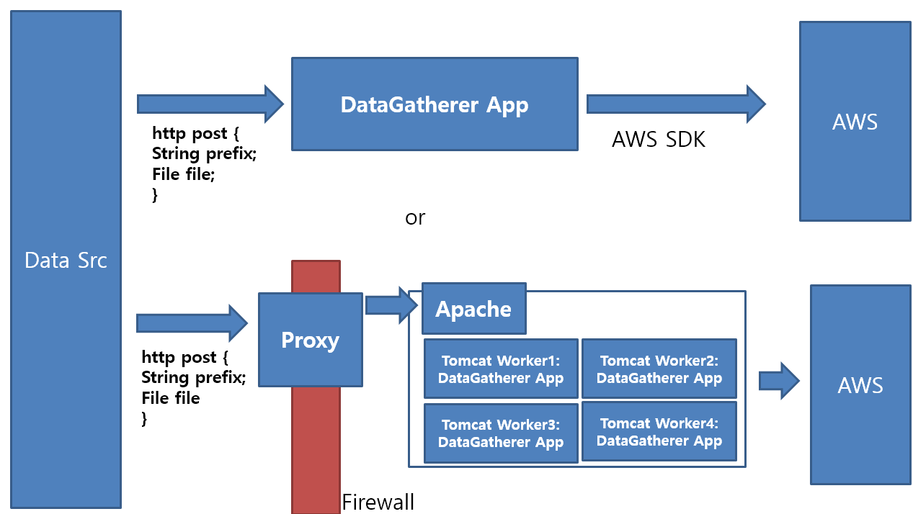

# DataGatherer
### 1. What is this?
This is a data gathering service provider application
for machine learning.  

### 2. What does this do?
A. Put your AWS SDK codes to this app and manage them in one.  
B. you send HTTP request like below.  
{  
File file;  
data   
{String prefix};  
}  
Then the app will send the file to your S3 bucket, prefix attached.

#### Http send example code :

### 3. Configuration is done by yml.
Add a yml file like below to your project.
## /main/resources/application.yml 
<pre>
server:  
 port: 8080  
cloud:  
 aws:  
  credentials:  
   accessKey: # AWS IAM AccessKey  
   secretKey: # AWS IAM SecretKey  
  stack:  
   auto: false  
  region:  
   static: # AWS Region  
spring:  
 servlet:  
  multipart:  
   maxFileSize: 10MB  
   maxRequestSize: 10MB  
bucket:  
 name: # S3 Bucket Name  
proxy:  
 address: # Proxy Address  
tomcat:  
 ajp:  
  protocol: AJP/1.3 # Tomcat AJP Protocol  
  port: 8009 # Tomcat AJP Port  
  enabled: true  
allowed:
  ips: 127.0.0.0, 172.11.34.125
</pre>
### 4. Requirements
a. JAVA (corretto-11 or later)  
b. AWS SDK (SDK for Java)  
c. Spring framework   
d. if you use this as cluster, [Apache2, libapahe2-mod-jk]

### 5. How to use?
Config the yml file and run it as a spring boot app.
### 6. You can use this as cluster!  

ContainerConfig contains boilerplate codes for Apache + embedded Tomcat setting.   
Remember that 8009 is the default port number for ajp connection.  
Follow along. I used Ubuntu 20.04 LTS.

source and help :
https://makemodernweb.tistory.com/8

<pre>
sudo apt-get update # Update package list  
sudo apt-get install apache2 #install apache2
sudo ufw allow 80/tcp # allow apache2 port 80
</pre>

<pre>
sudo apt-get install libapache2-mod-jk # install apache2 mod_jk
sudo {your-editor} /etc/apache2/workers.properties # make a worker property file
</pre>

#### workers.properties code example  
<pre>
worker.list=worker1, load_balance # worker list
worker.worker1.port=8009 # worker1 port
worker.worker1.host=127.0.0.1 # worker1 host
worker.worker1.type=ajp13 # worker1 type
worker.worker1.lbfactor=1 # worker1 lbfactor

worker.load_balance.type=lb
worker.load_balance.balance_workers=worker1
</pre>

<pre>
sudo vi /etc/apache2/sites-available/000-default.conf
</pre>
#### 000-default.conf code example  
<pre>
<VirtualHost *:80>
  ServerAdmin webmaster@localhost 
  ServerName  localhost
  ServerAlias localhost
  JkMount /* load_balance
</VirtualHost>
</pre>

<pre>
sudo vi /etc/apache2/mods-available/jk.conf
</pre>
#### jk.conf code example
<pre>
&#60;IfModule jk_module&#62;
    JkWorkersFile /etc/apache2/workers.properties
</pre>